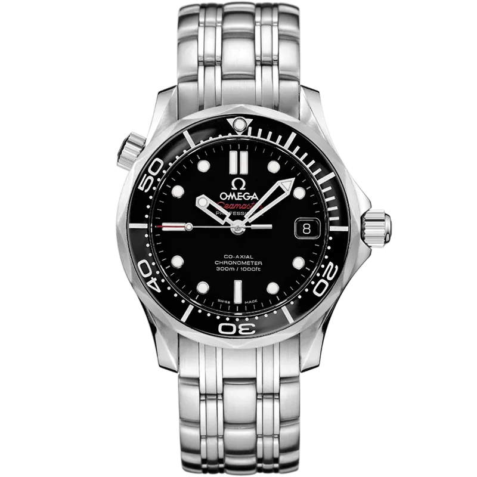
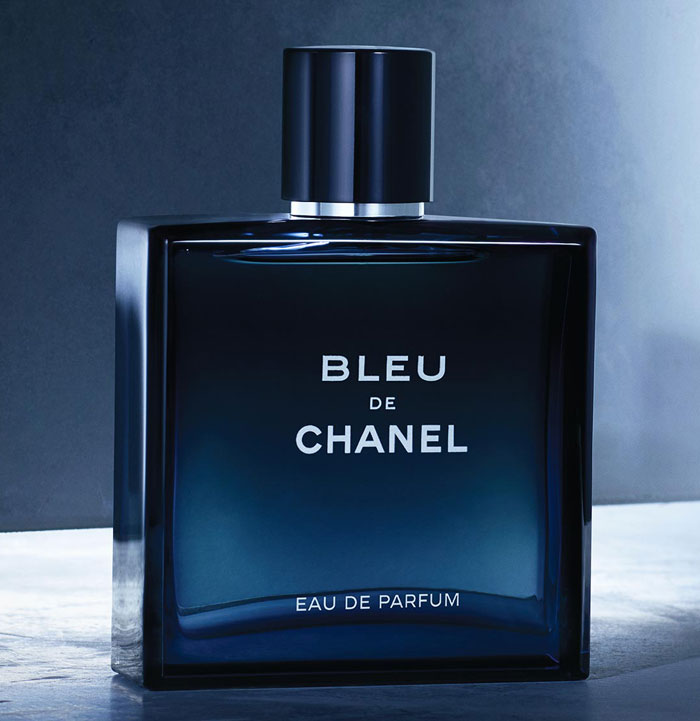
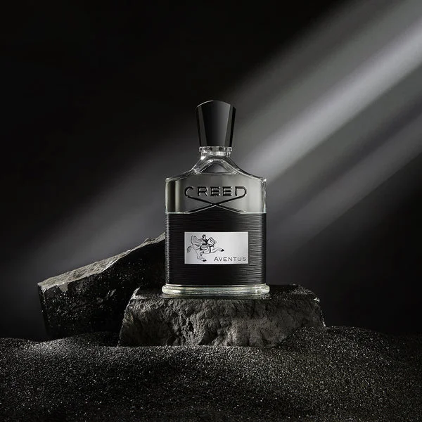
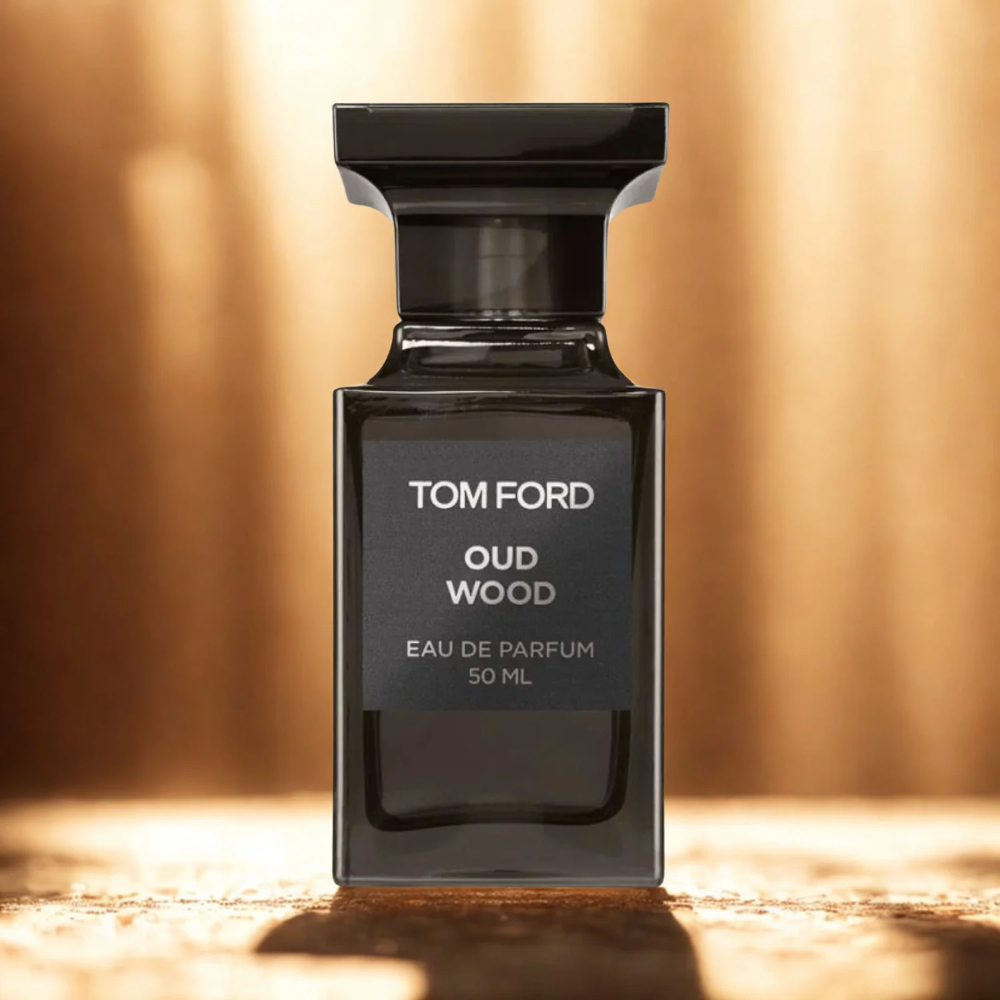
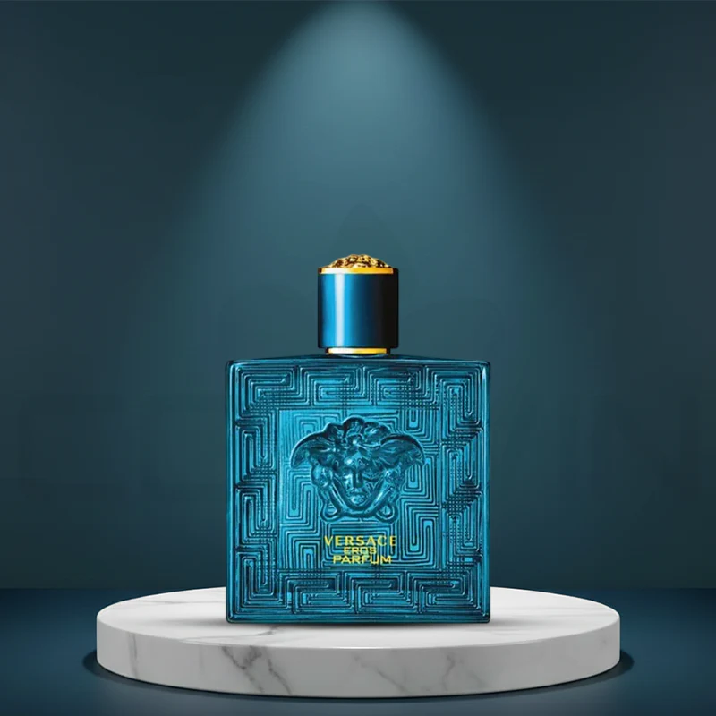
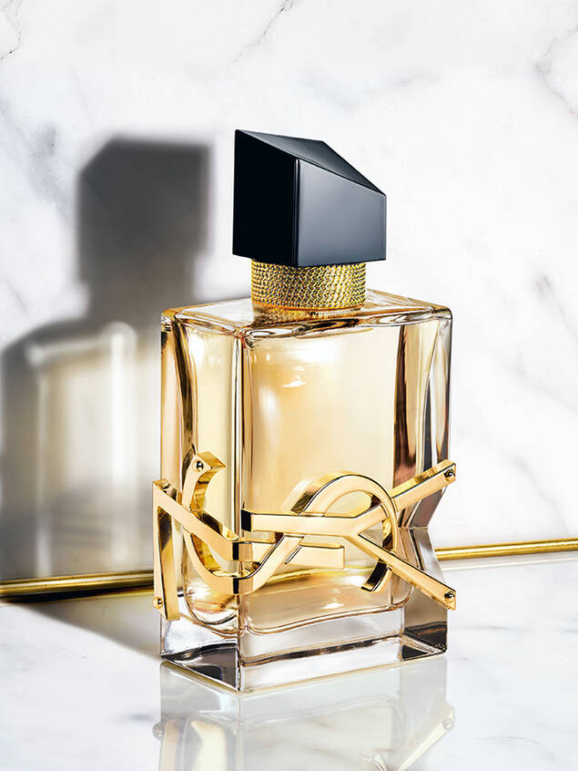
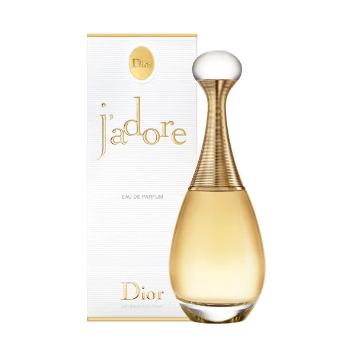

<!DOCTYPE html>
<html lang="en">

<head>
    <!-- ==========================
         META TAGS
    =========================== -->
    <meta charset="UTF-8">
    <meta name="viewport" content="width=device-width, initial-scale=1.0">

    <!-- ==========================
         WEBSITE TITLE
    =========================== -->
    <title>S-Y | Sherdil Yousafzai</title>

    <!-- ==========================
         GOOGLE FONTS
    =========================== -->
    <link rel="preconnect" href="https://fonts.googleapis.com">
    <link rel="preconnect" href="https://fonts.gstatic.com" crossorigin>

    <link
        href="https://fonts.googleapis.com/css2?family=Cinzel:wght@500;600;700&family=Outfit:wght@300;400;500;600;700;800&family=Poppins:wght@300;400;500;600&display=swap"
        rel="stylesheet">

    <!-- ==========================
         FONT AWESOME
    =========================== -->
    <link rel="stylesheet" href="https://cdnjs.cloudflare.com/ajax/libs/font-awesome/6.7.2/css/all.min.css">

    <!-- ==========================
         CSS FILE
    =========================== -->
    
  
</head>

<body>

    <!-- ==========================================
                    LOADER
    =========================================== -->

    

        

            

                S-Y
            

            <h1>Sherdil Yousafzai</h1>

            
Luxury Collection

            

                
            

        

    

    <!-- ==========================================
                WELCOME SCREEN
    =========================================== -->

    <section class="welcome-screen" id="welcome">

        

            <h4>WELCOME TO</h4>

            <h1>S-Y COLLECTION</h1>

            

                Premium Watches & Luxury Perfumes
            

            <form id="welcomeForm">

                

                    <i class="fa-solid fa-user"></i>

                    <input type="text" placeholder="Enter Your Name" required>

                

                

                    <i class="fa-solid fa-envelope"></i>

                    <input type="email" placeholder="Enter Your Email" required>

                

                <button type="submit">

                    ENTER

                    <i class="fa-solid fa-arrow-right"></i>

                </button>

            </form>

        

    </section>

    <!-- ==========================================
                    MAIN WEBSITE
    =========================================== -->

    

        <!-- ======================================
                    HEADER
        ======================================= -->

        <header>

            

                <nav class="navbar">

                    <!-- Logo -->

                    <a href="#" class="logo">

                        S-Y

                        <h2>Sherdil Yousafzai</h2>

                    </a>

                    <!-- Navigation -->

                    <ul class="nav-links">

                        <li><a href="#home">Home</a></li>

                        <li><a href="#watches">Watches</a></li>

                        <li><a href="#men">Men</a></li>

                        <li><a href="#women">Women</a></li>

                        <li><a href="#unisex">Unisex</a></li>

                        <li><a href="#about">About</a></li>

                        <li><a href="#contact">Contact</a></li>

                    </ul>

                    <!-- Right Side -->

                    

                        <!-- Search -->

                        <button class="icon-btn">

                            <i class="fa-solid fa-magnifying-glass"></i>

                        </button>

                        <!-- Dark Mode -->

                        <button id="themeToggle" class="icon-btn">

                            <i class="fa-solid fa-moon"></i>

                        </button>

                        <!-- Mobile Menu -->

                        <button class="menu-btn">

                            <i class="fa-solid fa-bars"></i>

                        </button>

                    

                </nav>

            

        </header>

        <!-- ======================================
                HERO SECTION
                (NEXT PART)
        ======================================= -->
        <!-- ======================================
                    HERO SECTION
        ======================================= -->

        <section class="hero" id="home">

            

            

                

                    
                        Luxury Watches & Premium Perfumes
                    

                    <h1>
                        Elevate Your
                        Style
                        With Timeless Luxury
                    </h1>

                    

                        Discover an exclusive collection of premium watches
                        and luxury fragrances crafted for men, women,
                        and everyone who appreciates elegance.
                    

                    

                        <a href="#watches" class="btn btn-primary">
                            Explore Collection
                        </a>

                        <a href="#about" class="btn btn-secondary">
                            Learn More
                        </a>

                    

                    

                        

                            <h2>250+</h2>

                            
Luxury Products

                        

                        

                            <h2>10K+</h2>

                            
Happy Visitors

                        

                        

                            <h2>100%</h2>

                            
Premium Quality

                        

                    

                

                

                    

                    

                    

                    

                        <i class="fa-regular fa-clock"></i>

                        <h3>Luxury Watches</h3>

                    

                    

                        <i class="fa-solid fa-wine-bottle"></i>

                        <h3>Premium Perfumes</h3>

                    

                    

                        

                            S-Y

                        

                        <h2>Sherdil Yousafzai</h2>

                        

                            Premium Collection
                        

                    

                

            

            <a href="#watches" class="scroll-down">

                

            </a>

        </section>

        <!-- ======================================
                FEATURED CATEGORIES
        ======================================= -->

        <section class="categories">

            

                

                    Our Collection

                    <h2>
                        Luxury Categories
                    </h2>

                    

                        Explore our premium selection crafted for
                        elegance, confidence and timeless style.
                    

                

                

                    

                        <i class="fa-regular fa-clock"></i>

                        <h3>Luxury Watches</h3>

                        

                            Premium timepieces for every occasion.
                        

                    

                    

                        <i class="fa-solid fa-user-tie"></i>

                        <h3>Men Perfumes</h3>

                        

                            Powerful and long-lasting fragrances.
                        

                    

                    

                        <i class="fa-solid fa-heart"></i>

                        <h3>Women Perfumes</h3>

                        

                            Elegant and luxurious floral scents.
                        

                    

                    

                        <i class="fa-solid fa-star"></i>

                        <h3>Unisex Collection</h3>

                        

                            Modern fragrances loved by everyone.
                        

                    

                

            

        </section>

        <!-- ======================================
            WATCHES SECTION
            (NEXT PART)
        ======================================= -->
        <!-- ======================================
                    WATCHES SECTION
        ======================================= -->

        <section class="products" id="watches">

            

                

                    Premium Timepieces

                    <h2>Luxury Watch Collection</h2>

                    

                        Discover timeless craftsmanship with our exclusive
                        luxury watch collection.
                    

                

                

                    <!-- Card 1 -->

                    

                        

                            

                            <button class="wishlist">
                                <i class="fa-regular fa-heart"></i>
                            </button>

                        

                        

                            <h3>Rolex Submariner</h3>

                            

                                <i class="fa-solid fa-star"></i>
                                <i class="fa-solid fa-star"></i>
                                <i class="fa-solid fa-star"></i>
                                <i class="fa-solid fa-star"></i>
                                <i class="fa-solid fa-star-half-stroke"></i>

                            

                            <h4>$12,999</h4>

                            <a href="#" class="product-btn">
                                View Details
                            </a>

                        

                    

                    <!-- Card 2 -->

                    

                        

                            

                            <button class="wishlist">
                                <i class="fa-regular fa-heart"></i>
                            </button>

                        

                        

                            <h3>Omega Seamaster</h3>

                            

                                <i class="fa-solid fa-star"></i>
                                <i class="fa-solid fa-star"></i>
                                <i class="fa-solid fa-star"></i>
                                <i class="fa-solid fa-star"></i>
                                <i class="fa-solid fa-star"></i>

                            

                            <h4>$9,499</h4>

                            <a href="#" class="product-btn">
                                View Details
                            </a>

                        

                    

                    <!-- Card 3 -->

                    

                        

                            

                            <button class="wishlist">
                                <i class="fa-regular fa-heart"></i>
                            </button>

                        

                        

                            <h3>Patek Philippe</h3>

                            

                                <i class="fa-solid fa-star"></i>
                                <i class="fa-solid fa-star"></i>
                                <i class="fa-solid fa-star"></i>
                                <i class="fa-solid fa-star"></i>
                                <i class="fa-solid fa-star"></i>

                            

                            <h4>$21,999</h4>

                            <a href="#" class="product-btn">
                                View Details
                            </a>

                        

                    

                    <!-- Card 4 -->

                    

                        

                            

                            <button class="wishlist">
                                <i class="fa-regular fa-heart"></i>
                            </button>

                        

                        

                            <h3>Tag Heuer Carrera</h3>

                            

                                <i class="fa-solid fa-star"></i>
                                <i class="fa-solid fa-star"></i>
                                <i class="fa-solid fa-star"></i>
                                <i class="fa-solid fa-star"></i>
                                <i class="fa-regular fa-star"></i>

                            

                            <h4>$6,899</h4>

                            <a href="#" class="product-btn">
                                View Details
                            </a>

                        

                    

                    <!-- Card 5 -->

                    

                        

                            

                            <button class="wishlist">
                                <i class="fa-regular fa-heart"></i>
                            </button>

                        

                        

                            <h3>Casio Edifice</h3>

                            

                                <i class="fa-solid fa-star"></i>
                                <i class="fa-solid fa-star"></i>
                                <i class="fa-solid fa-star"></i>
                                <i class="fa-solid fa-star-half-stroke"></i>
                                <i class="fa-regular fa-star"></i>

                            

                            <h4>$799</h4>

                            <a href="#" class="product-btn">
                                View Details
                            </a>

                        

                    

                    <!-- Card 6 -->

                    

                        

                            

                            <button class="wishlist">
                                <i class="fa-regular fa-heart"></i>
                            </button>

                        

                        

                            <h3>Seiko Presage</h3>

                            

                                <i class="fa-solid fa-star"></i>
                                <i class="fa-solid fa-star"></i>
                                <i class="fa-solid fa-star"></i>
                                <i class="fa-solid fa-star"></i>
                                <i class="fa-solid fa-star-half-stroke"></i>

                            

                            <h4>$1,299</h4>

                            <a href="#" class="product-btn">
                                View Details
                            </a>

                        

                    

                

            

        </section>

        <!-- ======================================
                MEN PERFUME SECTION
                (NEXT PART)
        ======================================= -->
        <!-- ======================================
                MEN'S PERFUME COLLECTION
        ======================================= -->

        <section class="products" id="men">

            

                

                    Luxury Fragrance

                    <h2>Men's Perfume Collection</h2>

                    

                        Discover premium fragrances designed for confidence,
                        elegance and unforgettable impressions.
                    

                

                

                    <!-- Product 1 -->

                    

                        

                            

                            <button class="wishlist">
                                <i class="fa-regular fa-heart"></i>
                            </button>

                        

                        

                            <h3>Dior Sauvage</h3>

                            

                                <i class="fa-solid fa-star"></i>
                                <i class="fa-solid fa-star"></i>
                                <i class="fa-solid fa-star"></i>
                                <i class="fa-solid fa-star"></i>
                                <i class="fa-solid fa-star"></i>
                            

                            <h4>$165</h4>

                            <a href="#" class="product-btn">
                                View Details
                            </a>

                        

                    

                    <!-- Product 2 -->

                    

                        

                            

                            <button class="wishlist">
                                <i class="fa-regular fa-heart"></i>
                            </button>

                        

                        

                            <h3>Bleu de Chanel</h3>

                            

                                <i class="fa-solid fa-star"></i>
                                <i class="fa-solid fa-star"></i>
                                <i class="fa-solid fa-star"></i>
                                <i class="fa-solid fa-star"></i>
                                <i class="fa-solid fa-star-half-stroke"></i>
                            

                            <h4>$180</h4>

                            <a href="#" class="product-btn">
                                View Details
                            </a>

                        

                    

                    <!-- Product 3 -->

                    

                        

                            

                            <button class="wishlist">
                                <i class="fa-regular fa-heart"></i>
                            </button>

                        

                        

                            <h3>Creed Aventus</h3>

                            

                                <i class="fa-solid fa-star"></i>
                                <i class="fa-solid fa-star"></i>
                                <i class="fa-solid fa-star"></i>
                                <i class="fa-solid fa-star"></i>
                                <i class="fa-solid fa-star"></i>
                            

                            <h4>$420</h4>

                            <a href="#" class="product-btn">
                                View Details
                            </a>

                        

                    

                    <!-- Product 4 -->

                    

                        

                            

                            <button class="wishlist">
                                <i class="fa-regular fa-heart"></i>
                            </button>

                        

                        

                            <h3>Tom Ford Oud Wood</h3>

                            

                                <i class="fa-solid fa-star"></i>
                                <i class="fa-solid fa-star"></i>
                                <i class="fa-solid fa-star"></i>
                                <i class="fa-solid fa-star"></i>
                                <i class="fa-solid fa-star-half-stroke"></i>
                            

                            <h4>$395</h4>

                            <a href="#" class="product-btn">
                                View Details
                            </a>

                        

                    

                    <!-- Product 5 -->

                    

                        

                            

                            <button class="wishlist">
                                <i class="fa-regular fa-heart"></i>
                            </button>

                        

                        

                            <h3>Versace Eros</h3>

                            

                                <i class="fa-solid fa-star"></i>
                                <i class="fa-solid fa-star"></i>
                                <i class="fa-solid fa-star"></i>
                                <i class="fa-solid fa-star"></i>
                                <i class="fa-regular fa-star"></i>
                            

                            <h4>$145</h4>

                            <a href="#" class="product-btn">
                                View Details
                            </a>

                        

                    

                    <!-- Product 6 -->

                    

                        

                            

                            <button class="wishlist">
                                <i class="fa-regular fa-heart"></i>
                            </button>

                        

                        

                            <h3>Acqua Di Gio</h3>

                            

                                <i class="fa-solid fa-star"></i>
                                <i class="fa-solid fa-star"></i>
                                <i class="fa-solid fa-star"></i>
                                <i class="fa-solid fa-star"></i>
                                <i class="fa-solid fa-star-half-stroke"></i>
                            

                            <h4>$155</h4>

                            <a href="#" class="product-btn">
                                View Details
                            </a>

                        

                    

                

            

        </section>

        <!-- ======================================
            WOMEN'S PERFUME COLLECTION
            (PART 4.2)
        ======================================= -->
        <!-- ======================================
                WOMEN'S PERFUME COLLECTION
        ======================================= -->

        <section class="products" id="women">

            

                

                    Luxury Fragrance

                    <h2>Women's Perfume Collection</h2>

                    

                        Elegant, floral and luxurious fragrances crafted
                        for women who love sophistication and timeless beauty.
                    

                

                

                    <!-- Product 1 -->

                    

                        

                            

                            <button class="wishlist">
                                <i class="fa-regular fa-heart"></i>
                            </button>

                        

                        

                            <h3>Chanel Coco Mademoiselle</h3>

                            

                                <i class="fa-solid fa-star"></i>
                                <i class="fa-solid fa-star"></i>
                                <i class="fa-solid fa-star"></i>
                                <i class="fa-solid fa-star"></i>
                                <i class="fa-solid fa-star"></i>
                            

                            <h4>$185</h4>

                            <a href="#" class="product-btn">
                                View Details
                            </a>

                        

                    

                    <!-- Product 2 -->

                    

                        

                            

                            <button class="wishlist">
                                <i class="fa-regular fa-heart"></i>
                            </button>

                        

                        

                            <h3>Gucci Bloom</h3>

                            

                                <i class="fa-solid fa-star"></i>
                                <i class="fa-solid fa-star"></i>
                                <i class="fa-solid fa-star"></i>
                                <i class="fa-solid fa-star"></i>
                                <i class="fa-solid fa-star-half-stroke"></i>
                            

                            <h4>$165</h4>

                            <a href="#" class="product-btn">
                                View Details
                            </a>

                        

                    

                    <!-- Product 3 -->

                    

                        

                            

                            <button class="wishlist">
                                <i class="fa-regular fa-heart"></i>
                            </button>

                        

                        

                            <h3>YSL Libre</h3>

                            

                                <i class="fa-solid fa-star"></i>
                                <i class="fa-solid fa-star"></i>
                                <i class="fa-solid fa-star"></i>
                                <i class="fa-solid fa-star"></i>
                                <i class="fa-solid fa-star"></i>
                            

                            <h4>$172</h4>

                            <a href="#" class="product-btn">
                                View Details
                            </a>

                        

                    

                    <!-- Product 4 -->

                    

                        

                            

                            <button class="wishlist">
                                <i class="fa-regular fa-heart"></i>
                            </button>

                        

                        

                            <h3>Dior J'adore</h3>

                            

                                <i class="fa-solid fa-star"></i>
                                <i class="fa-solid fa-star"></i>
                                <i class="fa-solid fa-star"></i>
                                <i class="fa-solid fa-star"></i>
                                <i class="fa-solid fa-star-half-stroke"></i>
                            

                            <h4>$178</h4>

                            <a href="#" class="product-btn">
                                View Details
                            </a>

                        

                    

                    <!-- Product 5 -->

                    

                        

                            

                            <button class="wishlist">
                                <i class="fa-regular fa-heart"></i>
                            </button>

                        

                        

                            <h3>Black Opium</h3>

                            

                                <i class="fa-solid fa-star"></i>
                                <i class="fa-solid fa-star"></i>
                                <i class="fa-solid fa-star"></i>
                                <i class="fa-solid fa-star"></i>
                                <i class="fa-regular fa-star"></i>
                            

                            <h4>$160</h4>

                            <a href="#" class="product-btn">
                                View Details
                            </a>

                        

                    

                    <!-- Product 6 -->

                    

                        

                            

                            <button class="wishlist">
                                <i class="fa-regular fa-heart"></i>
                            </button>

                        

                        

                            <h3>Miss Dior</h3>

                            

                                <i class="fa-solid fa-star"></i>
                                <i class="fa-solid fa-star"></i>
                                <i class="fa-solid fa-star"></i>
                                <i class="fa-solid fa-star"></i>
                                <i class="fa-solid fa-star-half-stroke"></i>
                            

                            <h4>$170</h4>

                            <a href="#" class="product-btn">
                                View Details
                            </a>

                        

                    

                

            

        </section>

        <!-- ======================================
            UNISEX PERFUME COLLECTION
            (PART 4.3)
        ======================================= -->
        <!-- ======================================
                UNISEX PERFUME COLLECTION
        ======================================= -->

        <section class="products" id="unisex">

            

                

                    Signature Collection

                    <h2>Unisex Perfume Collection</h2>

                    

                        Sophisticated fragrances designed for everyone who
                        appreciates timeless elegance and modern luxury.
                    

                

                

                    <!-- Product 1 -->

                    

                        

                            

                            <button class="wishlist">
                                <i class="fa-regular fa-heart"></i>
                            </button>

                        

                        

                            <h3>Baccarat Rouge 540</h3>

                            

                                <i class="fa-solid fa-star"></i>
                                <i class="fa-solid fa-star"></i>
                                <i class="fa-solid fa-star"></i>
                                <i class="fa-solid fa-star"></i>
                                <i class="fa-solid fa-star"></i>
                            

                            <h4>$395</h4>

                            <a href="#" class="product-btn">
                                View Details
                            </a>

                        

                    

                    <!-- Product 2 -->

                    

                        

                            

                            <button class="wishlist">
                                <i class="fa-regular fa-heart"></i>
                            </button>

                        

                        

                            <h3>Tom Ford Tobacco Vanille</h3>

                            

                                <i class="fa-solid fa-star"></i>
                                <i class="fa-solid fa-star"></i>
                                <i class="fa-solid fa-star"></i>
                                <i class="fa-solid fa-star"></i>
                                <i class="fa-solid fa-star-half-stroke"></i>
                            

                            <h4>$320</h4>

                            <a href="#" class="product-btn">
                                View Details
                            </a>

                        

                    

                    <!-- Product 3 -->

                    

                        

                            

                            <button class="wishlist">
                                <i class="fa-regular fa-heart"></i>
                            </button>

                        

                        

                            <h3>Creed Silver Mountain Water</h3>

                            

                                <i class="fa-solid fa-star"></i>
                                <i class="fa-solid fa-star"></i>
                                <i class="fa-solid fa-star"></i>
                                <i class="fa-solid fa-star"></i>
                                <i class="fa-solid fa-star"></i>
                            

                            <h4>$410</h4>

                            <a href="#" class="product-btn">
                                View Details
                            </a>

                        

                    

                    <!-- Product 4 -->

                    

                        

                            

                            <button class="wishlist">
                                <i class="fa-regular fa-heart"></i>
                            </button>

                        

                        

                            <h3>Jo Malone Wood Sage & Sea Salt</h3>

                            

                                <i class="fa-solid fa-star"></i>
                                <i class="fa-solid fa-star"></i>
                                <i class="fa-solid fa-star"></i>
                                <i class="fa-solid fa-star"></i>
                                <i class="fa-regular fa-star"></i>
                            

                            <h4>$185</h4>

                            <a href="#" class="product-btn">
                                View Details
                            </a>

                        

                    

                    <!-- Product 5 -->

                    

                        

                            

                            <button class="wishlist">
                                <i class="fa-regular fa-heart"></i>
                            </button>

                        

                        

                            <h3>CK One</h3>

                            

                                <i class="fa-solid fa-star"></i>
                                <i class="fa-solid fa-star"></i>
                                <i class="fa-solid fa-star"></i>
                                <i class="fa-solid fa-star-half-stroke"></i>
                                <i class="fa-regular fa-star"></i>
                            

                            <h4>$95</h4>

                            <a href="#" class="product-btn">
                                View Details
                            </a>

                        

                    

                    <!-- Product 6 -->

                    

                        

                            

                            <button class="wishlist">
                                <i class="fa-regular fa-heart"></i>
                            </button>
                        

                        

                            <h3>Le Labo Santal 33</h3>

                            

                                <i class="fa-solid fa-star"></i>
                                <i class="fa-solid fa-star"></i>
                                <i class="fa-solid fa-star"></i>
                                <i class="fa-solid fa-star"></i>
                                <i class="fa-solid fa-star"></i>
                            

                            <h4>$310</h4>

                            <a href="#" class="product-btn">
                                View Details
                            </a>

                        

                    

                

            

        </section>

        <!-- ======================================
                ABOUT US
                (PART 5.1)
        ======================================= -->
        <!-- ======================================
                    ABOUT SECTION
        ======================================= -->

        <section class="about" id="about">

            

                

                    <!-- Left Side -->

                    

                        

                            

                                <h2>10+</h2>

                                
Years of Luxury Inspiration

                            

                            

                                S-Y

                            

                        

                    

                    <!-- Right Side -->

                    

                        

                            ABOUT S-Y COLLECTION

                        

                        <h2>

                            Crafted For People Who Appreciate
                            Luxury, Style & Elegance.

                        </h2>

                        

                            Welcome to <strong>S-Y | Sherdil Yousafzai</strong>,
                            a premium destination where timeless luxury meets
                            modern style.

                        

                        

                            Our carefully selected watches and fragrances
                            represent elegance, confidence and sophistication.
                            Every product is chosen to deliver a premium
                            experience.

                        

                        <!-- Features -->

                        

                            

                                <i class="fa-solid fa-gem"></i>

                                

                                    <h4>Premium Quality</h4>

                                    

                                        Carefully selected luxury products.
                                    

                                

                            

                            

                                <i class="fa-solid fa-shield-halved"></i>

                                

                                    <h4>Trusted Collection</h4>

                                    

                                        Designed for style and confidence.
                                    

                                

                            

                            

                                <i class="fa-solid fa-truck-fast"></i>

                                

                                    <h4>Fast Delivery</h4>

                                    

                                        Quick and secure shipping experience.
                                    

                                

                            

                            

                                <i class="fa-solid fa-award"></i>

                                

                                    <h4>Luxury Experience</h4>

                                    

                                        Premium design with modern elegance.
                                    

                                

                            

                        

                        <a href="#contact" class="btn btn-primary">

                            Contact Us

                        </a>

                    

                

            

        </section>

        <!-- ======================================
                WHY CHOOSE US
        ======================================= -->

        <section class="why-us">

            

                

                    WHY CHOOSE US

                    <h2>
                        Experience Premium Excellence
                    </h2>

                    

                        Every detail is designed to provide
                        elegance, quality and luxury.

                    

                

                

                    

                        <i class="fa-solid fa-crown"></i>

                        <h3>Luxury Products</h3>

                        

                            Carefully curated premium watches
                            and fragrances.

                        

                    

                    

                        <i class="fa-solid fa-star"></i>

                        <h3>Top Rated</h3>

                        

                            High quality collections loved
                            by luxury enthusiasts.

                        

                    

                    

                        <i class="fa-solid fa-lock"></i>

                        <h3>Secure Shopping</h3>

                        

                            Safe browsing with a premium
                            user experience.

                        

                    

                    

                        <i class="fa-solid fa-headset"></i>

                        <h3>24/7 Support</h3>

                        

                            Always ready to help you with
                            every inquiry.

                        

                    

                

            

        </section>

        <!-- ======================================
                ACHIEVEMENTS
        ======================================= -->

        <section class="stats">

            

                

                    

                        <h2>500+</h2>

                        
Luxury Products

                    

                    

                        <h2>15K+</h2>

                        
Happy Visitors

                    

                    

                        <h2>100%</h2>

                        
Premium Quality

                    

                    

                        <h2>24/7</h2>

                        
Customer Support

                    

                

            

        </section>

        <!-- ======================================
                REVIEWS
                (PART 5.2)
        ======================================= -->
        <!-- ======================================
                    CUSTOMER REVIEWS
        ======================================= -->

        <section class="reviews" id="reviews">

            

                

                    TESTIMONIALS

                    <h2>What Our Visitors Say</h2>

                    

                        Discover why people love the luxury experience of
                        S-Y | Sherdil Yousafzai Collection.
                    

                

                

                    <!-- Review 1 -->

                    

                        

                            <i class="fa-solid fa-quote-left"></i>

                        

                        

                            Beautiful website with a truly premium feel.
                            The luxury watch collection is amazing and the
                            design looks incredibly professional.

                        

                        

                            <i class="fa-solid fa-star"></i>
                            <i class="fa-solid fa-star"></i>
                            <i class="fa-solid fa-star"></i>
                            <i class="fa-solid fa-star"></i>
                            <i class="fa-solid fa-star"></i>

                        

                        

                            

                                <i class="fa-solid fa-user"></i>

                            

                            

                                <h4>James Wilson</h4>

                                Watch Collector

                            

                        

                    

                    <!-- Review 2 -->

                    

                        

                            <i class="fa-solid fa-quote-left"></i>

                        

                        

                            The perfume collection is impressive and the
                            animations make the whole website feel premium.

                        

                        

                            <i class="fa-solid fa-star"></i>
                            <i class="fa-solid fa-star"></i>
                            <i class="fa-solid fa-star"></i>
                            <i class="fa-solid fa-star"></i>
                            <i class="fa-solid fa-star"></i>

                        

                        

                            

                                <i class="fa-solid fa-user"></i>

                            

                            

                                <h4>Emily Carter</h4>

                                Luxury Fragrance Lover

                            

                        

                    

                    <!-- Review 3 -->

                    

                        

                            <i class="fa-solid fa-quote-left"></i>

                        

                        

                            One of the cleanest luxury collection websites
                            I have seen. Smooth, elegant and modern.

                        

                        

                            <i class="fa-solid fa-star"></i>
                            <i class="fa-solid fa-star"></i>
                            <i class="fa-solid fa-star"></i>
                            <i class="fa-solid fa-star"></i>
                            <i class="fa-solid fa-star"></i>

                        

                        

                            

                                <i class="fa-solid fa-user"></i>

                            

                            

                                <h4>Daniel Thomas</h4>

                                Fashion Enthusiast

                            

                        

                    

                

            

        </section>

        <!-- ======================================
                    NEWSLETTER
        ======================================= -->

        <section class="newsletter">

            

                

                    JOIN OUR COMMUNITY

                    <h2>

                        Stay Updated With Luxury
                        Collections & Exclusive Offers

                    </h2>

                    

                        Subscribe to receive updates about premium watches,
                        luxury perfumes and upcoming collections.

                    

                    <form class="newsletter-form">

                        <input type="email" placeholder="Enter Your Email Address" required>

                        <button type="submit">

                            Subscribe

                            <i class="fa-solid fa-paper-plane"></i>

                        </button>

                    </form>

                

            

        </section>

        <!-- ======================================
                    CALL TO ACTION
        ======================================= -->

        <section class="cta">

            

                

                    <h2>

                        Experience Luxury Like Never Before

                    </h2>

                    

                        Explore premium watches and luxury fragrances
                        crafted for modern elegance.

                    

                    <a href="#watches" class="btn btn-primary">

                        Explore Now

                    </a>

                

            

        </section>

        <!-- ======================================
                CONTACT & FOOTER
                (PART 5.3)
        ======================================= -->
        <!-- ======================================
                    CONTACT SECTION
        ======================================= -->

        <section class="contact" id="contact">

            

                

                    CONTACT US

                    <h2>Get In Touch</h2>

                    

                        We'd love to hear from you. Send us your message and
                        we'll get back to you as soon as possible.
                    

                

                

                    <!-- Contact Info -->

                    

                        

                            <i class="fa-solid fa-location-dot"></i>

                            

                                <h4>Location</h4>
                                
Pakistan

                            

                        

                        

                            <i class="fa-solid fa-envelope"></i>

                            

                                <h4>Email</h4>

                                
info@sycollection.com

                            

                        

                        

                            <i class="fa-solid fa-phone"></i>

                            

                                <h4>Phone</h4>

                                
+92 300 1234567

                            

                        

                    

                    <!-- Contact Form -->

                    <form class="contact-form">

                        <input type="text" placeholder="Your Name" required>

                        <input type="email" placeholder="Your Email" required>

                        <input type="text" placeholder="Subject" required>

                        <textarea rows="6" placeholder="Write Your Message..." required></textarea>

                        <button type="submit" class="btn btn-primary">

                            Send Message

                        </button>

                    </form>

                

            

        </section>

        <!-- ======================================
                    FOOTER
        ======================================= -->

        <footer>

            

                

                    <!-- Column 1 -->

                    

                        <h2>

                            S-Y

                            Sherdil Yousafzai

                        </h2>

                        

                            A premium destination for luxury watches
                            and perfumes designed with elegance,
                            style and modern craftsmanship.

                        

                        

                            <a href="#">
                                <i class="fab fa-facebook-f"></i>
                            </a>

                            <a href="#">
                                <i class="fab fa-instagram"></i>
                            </a>

                            <a href="#">
                                <i class="fab fa-x-twitter"></i>
                            </a>

                            <a href="#">
                                <i class="fab fa-linkedin-in"></i>
                            </a>

                            <a href="#">
                                <i class="fab fa-github"></i>
                            </a>

                        

                    

                    <!-- Column 2 -->

                    

                        <h3>Quick Links</h3>

                        <ul>

                            <li><a href="#home">Home</a></li>

                            <li><a href="#about">About</a></li>

                            <li><a href="#contact">Contact</a></li>

                            <li><a href="#reviews">Reviews</a></li>

                        </ul>

                    

                    <!-- Column 3 -->

                    

                        <h3>Collections</h3>

                        <ul>

                            <li><a href="#watches">Luxury Watches</a></li>

                            <li><a href="#men">Men Perfumes</a></li>

                            <li><a href="#women">Women Perfumes</a></li>

                            <li><a href="#unisex">Unisex Perfumes</a></li>

                        </ul>

                    

                    <!-- Column 4 -->

                    

                        <h3>Support</h3>

                        <ul>

                            <li><a href="#">Privacy Policy</a></li>

                            <li><a href="#">Terms & Conditions</a></li>

                            <li><a href="#">Help Center</a></li>

                            <li><a href="#">FAQs</a></li>

                        </ul>

                    

                

                

                    

                        © 2026 S-Y | Sherdil Yousafzai.
                        All Rights Reserved.

                    

                

            

        </footer>

        <!-- ======================================
                SCROLL TO TOP BUTTON
        ======================================= -->

        <button class="scroll-top" id="scrollTop">

            <i class="fa-solid fa-arrow-up"></i>

        </button>

    

    <!-- ==========================
         JAVASCRIPT
    =========================== -->

    

</body>

</html>
